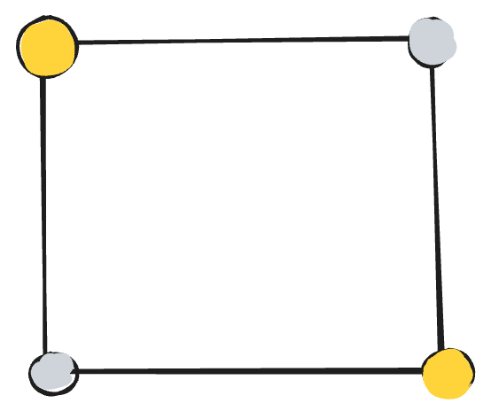

## Demon's table

You are in a room controlled by a demon mathematician. The square table has 4 buttons at the corners, which can either be on or off independently (you don't know which buttons are on or off). For escaping out of the room, you must have all buttons turned on. The doors immediately open when this state is reached. This is how you proceed:

 - In each step you can toggle the state of any subset of buttons simultaneously
 - After that, the demon can rotate the table by any multiple of 90 degrees (may be 0 degree also)

In how many steps can u say with guarantee that you can escape out of the room?

