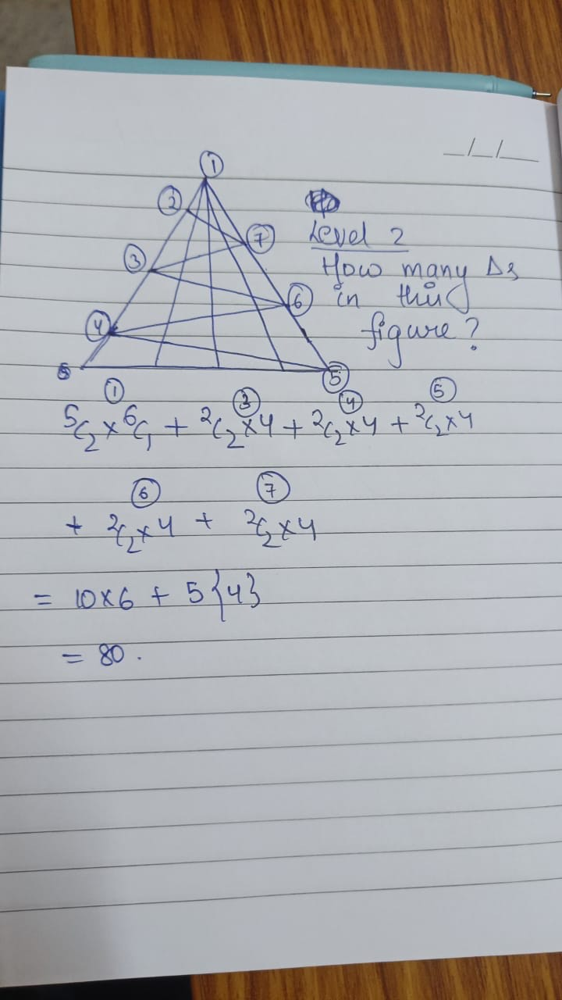

## Solution:

There are multiple ways to count this. One is something 
@divyanshjain learnt during his prep for NTSE, to directly come to a general formulae to find number of triangles formed:

Basically for a given base, if there are _n_ lines emerging from it, the number of trianges are nc2.
This number when multiplied by the number of unique bases, gives the total answer.


Again there are multiple ways to count this, and you don't have to remember any formulae. Below is the solution provided by @adityaagarwal



Another way of counting this as done by @somyajeet and @aryan is
```
(4c2*1 + 4c1*2)*5 + 5c2
```
(Proof is left as an exercise for the user)

## Answer

`80` for both level-1 and level-2